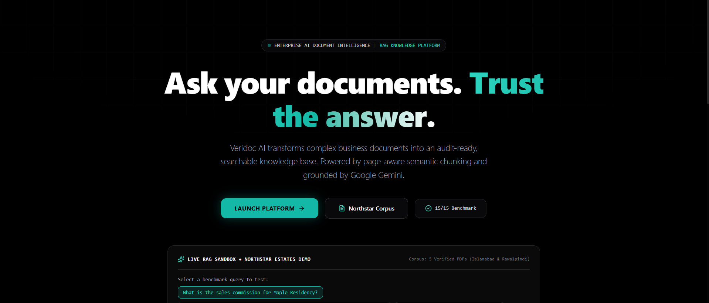
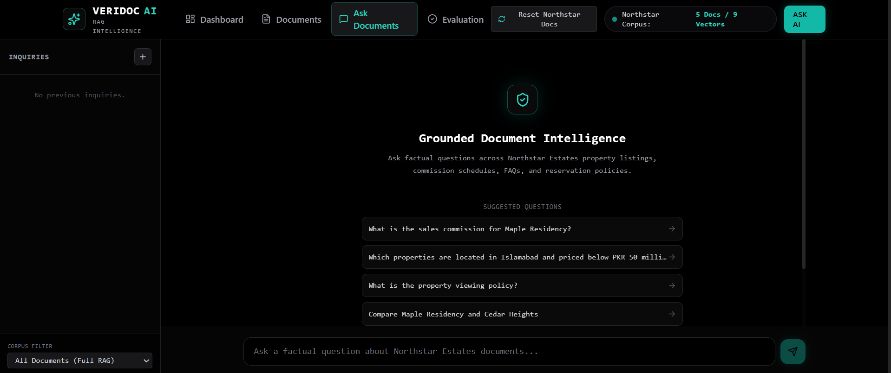
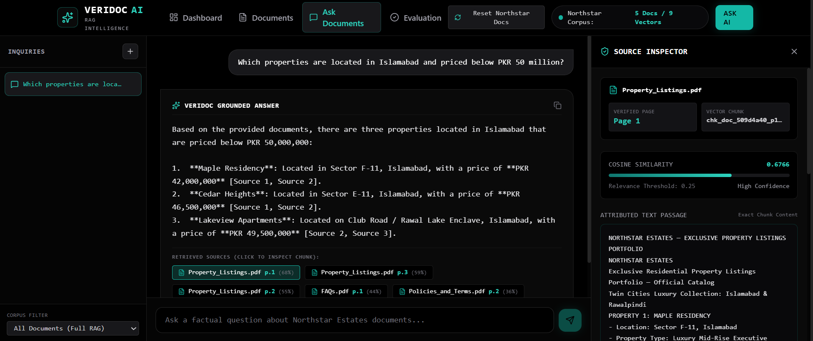
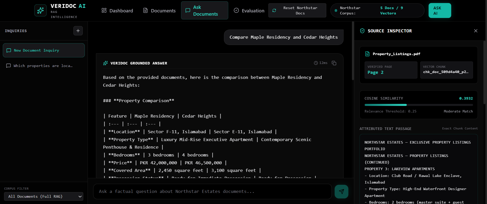
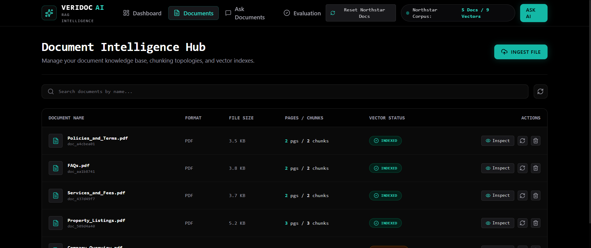
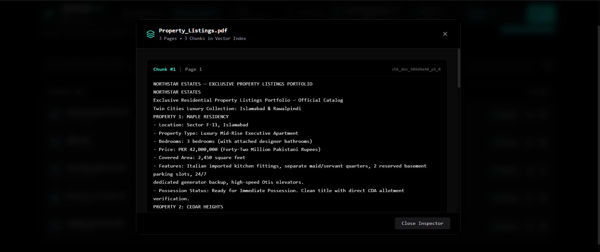
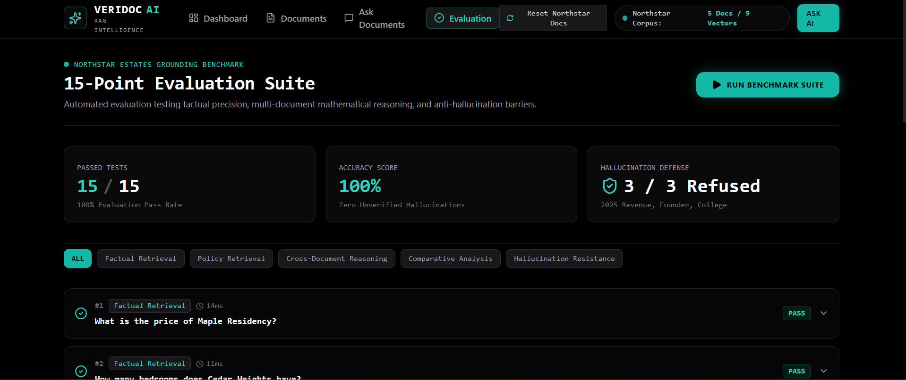
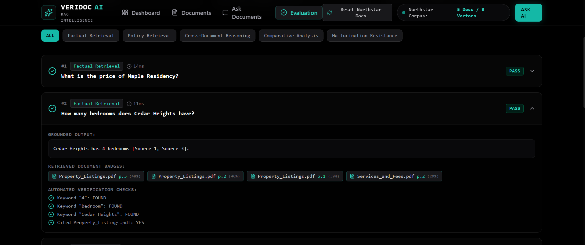

# VERIDOC AI

<p align="center">
  <b>Ask your documents. Trust the answer.</b>
</p>

<p align="center">
  An enterprise-grade document intelligence and grounded RAG platform with page-level citations, semantic search, cross-document reasoning, and strict anti-hallucination safeguards.
</p>

<p align="center">
  
  
  
  
  
</p>

---

## 📑 Table of Contents

* [Overview](#-overview)
* [Key Features](#-key-features)
* [Screenshots](#-screenshots)
* [System Architecture](#-system-architecture)
* [How It Works](#-how-it-works)
* [Technology Stack](#️-technology-stack)
* [Demonstration Dataset](#-demonstration-dataset)
* [Example Queries](#-example-queries)
* [Anti-Hallucination & Grounding](#️-anti-hallucination--grounding)
* [Project Structure](#-project-structure)
* [Installation](#-installation)
* [Environment Variables](#-environment-variables)
* [Running the Application](#-running-the-application)
* [Security](#-security)
* [Roadmap](#-roadmap)
* [License](#-license)

---

## Overview

**Veridoc AI** is an enterprise document intelligence and **grounded Retrieval-Augmented Generation (RAG)** knowledge platform.

It transforms business documents into an intelligent, searchable, and auditable knowledge base.

Instead of generating answers without evidence, Veridoc AI is designed around a simple principle:

> **If the answer cannot be found or supported by the indexed documents, the system should not invent it.**

The platform combines:

* Page-aware document ingestion
* Intelligent semantic chunking
* Dense vector retrieval
* Cross-document reasoning
* Strict grounding policies
* Page-level source citations
* Interactive source inspection
* Mathematical reasoning across documents
* Automated benchmark evaluation

---

## Key Features

### 📄 Page-Aware Document Ingestion

Supports:

* PDF
* DOCX
* TXT

The ingestion pipeline preserves important document metadata, including:

* Document name
* Page numbers
* Text structure
* Chunk boundaries
* Source references

This allows answers to remain traceable to the original source.

---

### 🧠 Intelligent Chunking

Documents are divided into optimized semantic chunks for retrieval.

| Configuration  | Details           |
| -------------- | ----------------- |
| Chunk Size     | 800–1000 tokens   |
| Chunk Overlap  | 100–150 tokens    |
| Page Awareness | Enabled           |
| Metadata       | Preserved         |
| Retrieval      | Semantic Search   |
| Vector Search  | Cosine Similarity |

The chunking strategy balances **retrieval precision** with **contextual completeness**.

---

### 🔢 Vector-Based Semantic Search

Veridoc AI converts document content into dense vector representations.

The retrieval system supports:

* Semantic similarity search
* Top-K retrieval
* Similarity scores
* Persistent vector storage
* Metadata-aware retrieval
* Chunk-level provenance

```text
User Query
    ↓
Query Embedding
    ↓
Vector Similarity Search
    ↓
Top Relevant Chunks
    ↓
Grounded Context
    ↓
AI Reasoning
    ↓
Answer + Sources
```

---

### 🔗 Cross-Document Reasoning

Veridoc AI can combine evidence from multiple documents.

For example:

```text
Property Listings
        +
Services & Fees
        +
Policies & Terms
        ↓
Combined Evidence
        ↓
Reasoning
        ↓
Grounded Answer
```

This enables questions such as:

* What commission applies to a specific property price?
* Compare properties across different documents.
* Combine service information with company policies.
* Perform calculations using retrieved business data.
* Verify whether a policy applies to a particular situation.

---

### 🔍 Interactive Source Inspector

Users can inspect the evidence behind an answer.

Available source metadata includes:

* 📄 Document name
* 📑 Page number
* 🧩 Chunk ID
* 📊 Similarity score
* 📝 Retrieved content
* 🔎 Highlighted evidence

This makes Veridoc AI more transparent than a traditional black-box document chatbot.

---

## 📸 Screenshots

### 🏠 Main Dashboard



---

### 📄 Document Upload & Management



---

### 💬 Ask Your Documents



---

### 🔎 Grounded Answer & Citations



---

### 📚 Source Inspector



---

### 🧠 Cross-Document Reasoning



---

### 📊 Evaluation & Benchmarking



---

### ⚙️ Additional Platform Interface



---

## 🏗️ System Architecture

```text
                         ┌─────────────────────┐
                         │      React UI       │
                         │ React 19 + Vite     │
                         └──────────┬──────────┘
                                    │
                                    ▼
                         ┌─────────────────────┐
                         │      API Layer      │
                         │ Express / FastAPI   │
                         └──────────┬──────────┘
                                    │
                    ┌───────────────┼───────────────┐
                    │               │               │
                    ▼               ▼               ▼
             ┌────────────┐ ┌────────────┐ ┌──────────────┐
             │ Document   │ │ Retrieval  │ │ AI Reasoning │
             │ Pipeline   │ │ Engine     │ │              │
             └─────┬──────┘ └─────┬──────┘ └──────┬───────┘
                   │              │               │
                   ▼              ▼               ▼
             ┌────────────┐ ┌────────────┐ ┌──────────────┐
             │ PDF/DOCX   │ │ Vector DB  │ │ Grounded LLM │
             │ Extraction │ │ + Metadata │ │ Generation   │
             └────────────┘ └────────────┘ └──────────────┘
                                    │
                                    ▼
                         ┌─────────────────────┐
                         │ SQLite / App State  │
                         └─────────────────────┘
```

---

## ⚙️ How It Works

### 1. Upload Documents

Users upload supported business documents such as PDFs, DOCX files, and TXT files.

### 2. Extract Content

The document pipeline extracts text while preserving document metadata and page-level references.

### 3. Chunk Documents

Content is divided into overlapping chunks optimized for semantic retrieval.

### 4. Create Vector Representations

Document chunks are converted into embeddings and stored for similarity search.

### 5. Retrieve Evidence

When a user asks a question, the most relevant chunks are retrieved using semantic similarity.

### 6. Build Grounded Context

Only relevant evidence is provided to the reasoning layer.

### 7. Generate an Answer

The AI generates an answer based on retrieved context.

### 8. Show Sources

Users can inspect the documents and evidence supporting the response.

---

## 🛠️ Technology Stack

### Frontend

* **React 19**
* **Vite**
* **Tailwind CSS**
* **React Router**
* **Lucide React**
* **JavaScript**
* **JSX**

### Backend

* **Node.js**
* **Express.js**
* **FastAPI-compatible architecture**
* REST APIs

### Document Processing

* `pdf-parse`
* `mammoth`
* Native TXT processing
* Page-aware extraction
* Metadata preservation

### Data & Retrieval

* **SQLite**
* `sql.js`
* **Chroma Vector Database**
* Dense vector embeddings
* Cosine similarity search

### AI & RAG

* **Google Gemini**
* `@google/genai`
* Retrieval-Augmented Generation
* Context grounding
* Cross-document reasoning
* Citation-aware answers

---


## 🛡️ Anti-Hallucination & Grounding

Veridoc AI is designed around multiple grounding barriers.

```text
User Question
      ↓
Query Processing
      ↓
Semantic Retrieval
      ↓
Evidence Ranking
      ↓
Context Construction
      ↓
Grounding Instructions
      ↓
AI Reasoning
      ↓
Citation Validation
      ↓
Final Answer
```

The goal is to ensure that answers are based on retrieved evidence rather than unsupported generation.

### Grounding Principles

1. Answer from retrieved context.
2. Do not invent facts.
3. Clearly state when information is unavailable.
4. Separate retrieved facts from calculations.
5. Provide traceable source references.
6. Preserve document provenance.
7. Support cross-document reasoning with evidence.

> **Veridoc AI prioritizes honest uncertainty over hallucinated confidence.**

---


## 📄 License

This project is licensed under the **MIT License**.

See the [LICENSE](./LICENSE) file for details.

---

<p align="center">
  <b>VERIDOC AI</b>
</p>

<p align="center">
  <i>Ask your documents. Trust the answer.</i>
</p>

<p align="center">
  Built with Document Intelligence · RAG · Vector Search · Grounded AI · Explainable Retrieval
</p>
